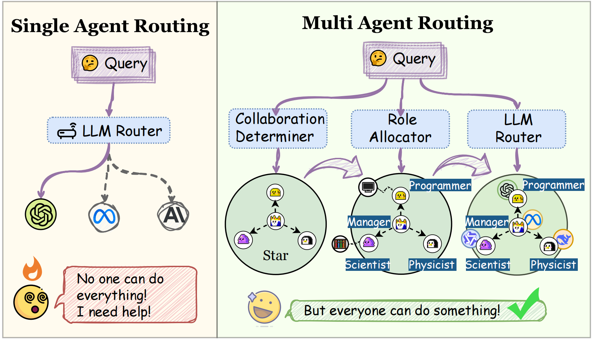

# MasRouter: Learning to Route LLMs for Multi-Agent Systems

## 🤔Why MasRouter?

**MasRouter** expands llm routing to the multi-agent systems(MAS) *for the first time*. It leverages the powerful reasoning capabilities of LLM MAS, while also making it relatively cost-effective.



## 👋🏻Method Summary

**MasRouter** integrates all components of MAS into a unified routing framework. It employs collaboration mode determination, role allocation, and LLM routing through a cascaded controller network, progressively constructing a MAS that balances effectiveness and efficiency.


## 🏃‍♂️‍➡️ Quick Start

### 📊 Datasets

Please download the  `GSM8K`,  `HumanEval`, `MATH`, `MBPP`, `MMLU` datasets and place it in the `Datasets` folder. The file structure should be organized as follows:
```
Datasets
└── gsm8k
    └── gsm8k.jsonl
└── humaneval
    └── humaneval-py.jsonl
└── MATH
    └── test
    └── train
└── mbpp
    └── mbpp.jsonl
└── MMLU
    └── data
```

### 🔑 Add API keys

Add API keys in `template.env` and change its name to `.env`. We recommend that this API be able to access multiple LLMs.
```python
URL = "" # the URL of LLM backend
KEY = "" # the key for API
```

### 🐹 Run the code

The code below verifies the experimental results of the `mbpp` dataset.

```bash
python experiments/run_mbpp.py
```

## 📚 Citation

If you find this repo useful, please consider citing our paper as follows:
```bibtex
@misc{yue2025masrouter,
      title={MasRouter: Learning to Route LLMs for Multi-Agent Systems}, 
      author={Yanwei Yue and Guibin Zhang and Boyang Liu and Guancheng Wan and Kun Wang and Dawei Cheng and Yiyan Qi},
      year={2025},
      eprint={2502.11133},
      archivePrefix={arXiv},
      primaryClass={cs.LG},
      url={https://arxiv.org/abs/2502.11133}, 
}
```

## 🙏 Acknowledgement

Special thanks to the following repositories for their invaluable code and datasets:

- [MapCoder](https://github.com/Md-Ashraful-Pramanik/MapCoder)
- [GPTSwarm](https://github.com/metauto-ai/GPTSwarm).