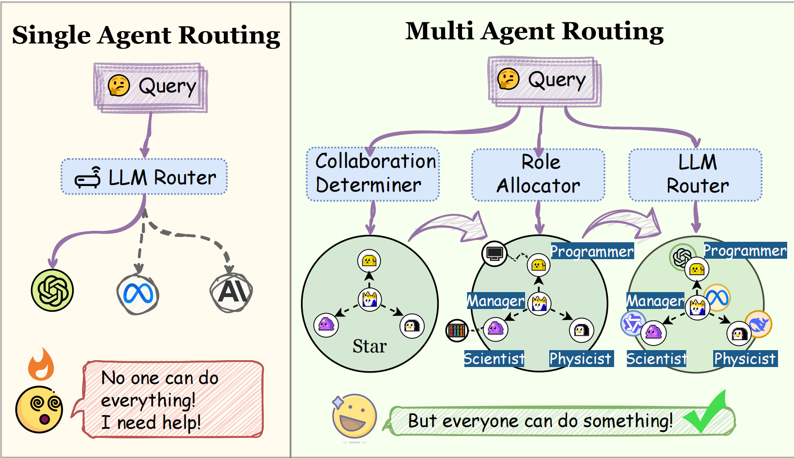
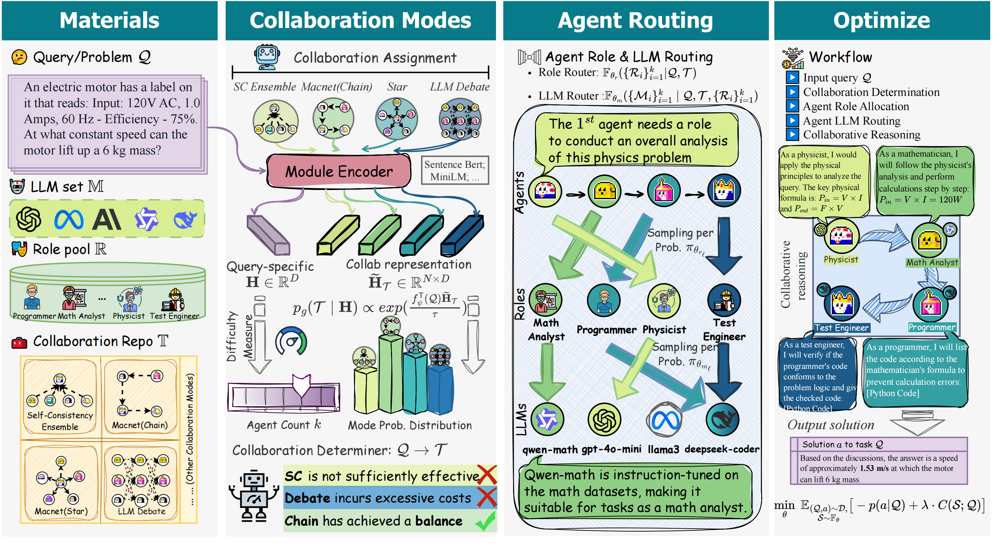

# MasRouter: Learning to Route LLMs for Multi-Agent Systems

## 🤔Why MasRouter?

**Masrouter** expands llm routing to the multi-agent systems(MAS) *for the first time*. MAS routing leverages the powerful reasoning capabilities of LLM MAS, while also making it relatively cost-effective.



## 👋🏻Method Summary

Masrouter integrates all components of MAS into a unified routing framework. It employs collaboration mode determination, role allocation, and LLM routing through a cascaded controller network, progressively constructing a MAS that balances effectiveness and efficiency.



## 🏃‍♂️‍➡️ Quick Start


### 📊 Datasets

Please download the  `GSM8K`,  `HumanEval`, `MATH`, `MBPP`, `MMLU` datasets and place it in the `Datasets` folder. The file structure should be organized as follows::
```
Datasets
└── gsm8k
    └── gsm8k.jsonl
└── humaneval
    └── humaneval-py.jsonl
└── MATH
    └── test
    └── train
└── mbpp
    └── mbpp.jsonl
└── MMLU
    └── data
```

### 🔑 Add API keys

```python
URL = "" # the URL of LLM backend
KEY = "" # the key for API
```
Add API keys in `template.env` and change its name to `.env`. We recommend that this API be able to access multiple LLMs.

### 🐹 Run the code

```bash
python experiments/run_mbpp.py
```

The above code verifies the experimental results of the `mbpp` dataset.

## 🙏 Acknowledgement
Special thanks to the following repositories for their invaluable code and datasets:

- [MapCoder](https://github.com/Md-Ashraful-Pramanik/MapCoder)
- [GPTSwarm](https://github.com/metauto-ai/GPTSwarm).